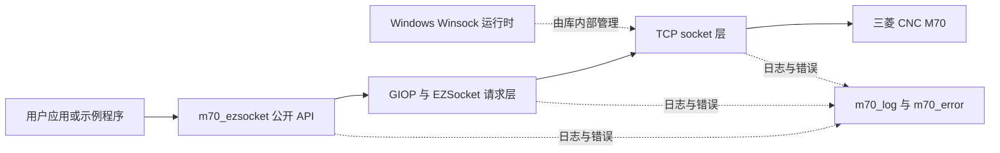
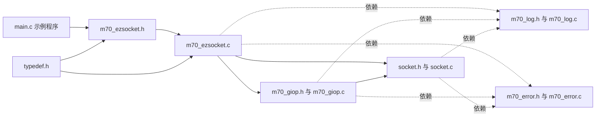
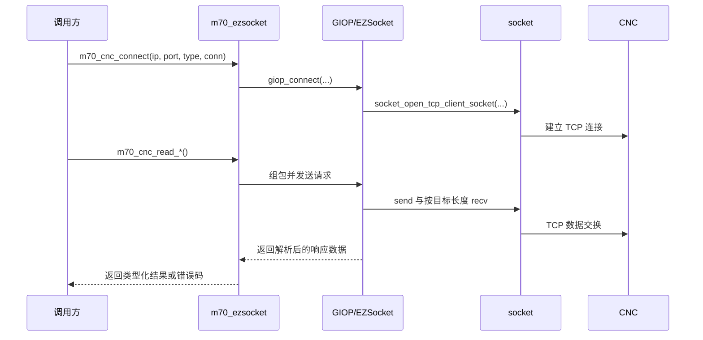

# 三菱 CNC M70 以太网通信库

[](https://opensource.org/licenses/MIT)

[English](README.md) | 简体中文

## 作者与版权信息

- 版权所有 Copyright (c) 2022-2026 wqliceman
- GitHub 用户名：iceman
- 邮箱：[wqliceman@gmail.com](mailto:wqliceman@gmail.com)
- 许可证：MIT，详见 [LICENSE](LICENSE)

## 目录

- 项目简介
    - 架构总览
- 当前状态
- 目录说明
    - 源码模块关系图
- 构建方式
    - 构建与 CI 覆盖矩阵
- 快速开始
    - 连接与读取流程
- API 概览
- 安全字符串接口（_ex）
- 日志与错误处理
- 兼容性说明
- 按业务场景分类的 API 索引
- 常见故障排查
- 版本变更记录模板
- 许可证

## 项目简介

本项目是一个基于 C 语言的三菱 CNC 控制器以太网通信库（当前重点支持 M70，协议为 EZSocket）。

主要提供：

- 连接管理能力
- 结构化数据读写接口
- 日志与错误处理组件
- Windows / Linux 跨平台支持

### 架构总览



公开 API 层负责暴露类型化读写接口，GIOP 层负责组织与解析 EZSocket 报文，socket 层负责 TCP 传输细节，例如把响应读满目标长度。

## 当前状态

- 开发语言：C
- 核心协议：EZSocket
- 已验证设备：Mitsubishi M70
- 默认构建产物：测试可执行程序
- Windows 运行时：库内部自动完成 Winsock 初始化与清理

## 目录说明

- `mitsubishi_cnc_m70_ezsocket_net/`：核心源码与测试入口（`main.c`）
- `README.md`：英文文档
- `README.zh-CN.md`：中文文档
- `makefile`、`common.mk`、`config.mk`：GNU Make 构建入口与配置
- `LICENSE`：MIT 许可证

### 源码模块关系图



对维护者来说，最关键的职责边界是：`m70_ezsocket` 负责公开 API，`m70_giop` 负责 EZSocket 组包与响应解析，`socket` 负责传输细节与运行时初始化。

## 构建方式

### Linux / WSL（GNU Make）

在仓库根目录执行：

```bash
make clean
make
```

默认会生成：

- `build/lib/libm70_ezsocket.a`
- POSIX/GCC 工具链下的 `build/lib/libm70_ezsocket.so`
- `build/bin/mitsubishi_cnc_m70_test`

额外目标：

```bash
make static
make shared
make example
make test
```

`make test` 会运行一个 socket 回归测试，覆盖分片读取和不完整响应触发断链清理两类场景。

### Windows

可选两种方式：

- 使用 `mitsubishi_cnc_m70_ezsocket_net/mitsubishi_cnc_m70_ezsocket_net.sln`（Visual Studio）
- 使用 WSL 执行 GNU Make 构建库、示例与测试目标

当前 Visual Studio 解决方案已经包含三类 MSVC 原生产物：

- 静态库：`m70_ezsocket.lib`
- 动态库：`m70_ezsocket.dll` 与对应 import lib
- 示例程序：`mitsubishi_cnc_m70_test.exe`

示例工程保留原有 `Debug`/`Release` 静态链接配置，同时新增 `DebugDll`/`ReleaseDll` 两套 DLL 消费配置。这两套配置会定义 `M70_USE_DLL`，并在构建后把 `m70_ezsocket.dll` 复制到示例程序输出目录。

MSVC 构建产物输出到：

- `mitsubishi_cnc_m70_ezsocket_net/build/msvc/static/<Platform>/<Configuration>/`
- `mitsubishi_cnc_m70_ezsocket_net/build/msvc/dll/<Platform>/<Configuration>/`
- `mitsubishi_cnc_m70_ezsocket_net/build/msvc/sample/<Platform>/<Configuration>/`

如果外部工程要链接 DLL，请在包含公开头文件前定义 `M70_USE_DLL`，让声明自动切换为 `dllimport`。

GitHub Actions CI 已配置在 `.github/workflows/ci.yml`，会在 Ubuntu 上验证 GNU Make 构建与测试，并在 Windows 上分别验证 `Release` 与 `ReleaseDll` 的 MSVC 构建，覆盖 `x86` 和 `x64`。

上面的 GNU Make 流程仍然负责 POSIX 共享库和回归测试目标。

### 构建与 CI 覆盖矩阵

| 路径 | 平台 | 入口 | 主要产物 | CI 覆盖 |
| --- | --- | --- | --- | --- |
| GNU Make | Linux / WSL | `make all`、`make test` | 静态库、POSIX 共享库、示例程序、回归测试 | `.github/workflows/ci.yml` 中的 Ubuntu 作业 |
| MSVC 静态链接 | Windows x86 / x64 | `Release` 解决方案配置 | `m70_ezsocket.lib` 与静态链接示例程序 | `.github/workflows/ci.yml` 中的 Windows 作业 |
| MSVC DLL | Windows x86 / x64 | `ReleaseDll` 解决方案配置 | `m70_ezsocket.dll`、import lib、DLL 链接示例程序 | `.github/workflows/ci.yml` 中的 Windows 作业 |
| 本地调试验证 | Windows x86 / x64 | `Debug`、`DebugDll` | 本地静态或 DLL 调试流程 | 本地 Visual Studio 使用 |

## 快速开始

头文件：

```c
#include "m70_ezsocket.h"
```

最小示例：

```c
#include <stdio.h>
#include "m70_ezsocket.h"

int main(void)
{
    m70_conn_t conn = {0};
    if (!m70_cnc_connect("192.168.123.130", 683, EZNC_SYS_MELDAS700M, &conn)) {
        return -1;
    }

    char nc_version[128] = {0};
    if (m70_cnc_read_nc_version_ex(&conn, nc_version, sizeof(nc_version)) == M70_ERROR_CODE_OK) {
        printf("NC Version: %s\n", nc_version);
    }

    m70_cnc_disconnect(&conn);
    return 0;
}
```

完整且持续维护的流程示例请参考：

- `mitsubishi_cnc_m70_ezsocket_net/main.c`

### 连接与读取流程



这张流程图有助于排查连接失败、分片读取、以及 DLL 消费接入时的职责边界问题。

## API 概览

### 连接接口

```c
bool m70_cnc_connect(const char* ip_addr, int port, m70_nc_type_e type, m70_conn_t* conn);
void m70_cnc_disconnect(m70_conn_t* conn);
```

### 常用读取接口

代表性函数：

- `m70_cnc_read_status`
- `m70_cnc_read_system_count`
- `m70_cnc_read_nc_axis_count`
- `m70_cnc_read_axis_position`
- `m70_cnc_read_spindle_speed`
- `m70_cnc_read_feed_speed`
- `m70_cnc_read_alarm`

### 常用写入接口

```c
m70_error_code_e m70_cnc_write_common_variable(m70_conn_t* conn, short system_no, uint32 index, double value);
m70_error_code_e m70_cnc_write_common_variable_comment(m70_conn_t* conn, uint32 index, char* value);
```

完整 API 声明见：

- `mitsubishi_cnc_m70_ezsocket_net/m70_ezsocket.h`

## 安全字符串接口（_ex）

推荐新代码优先使用 `_ex` 版本（显式传入缓冲区长度），降低越界风险。

示例：

```c
m70_cnc_read_nc_version_ex(conn, version, version_len);
m70_cnc_read_main_program_name_ex(conn, system_no, type, prog, prog_len);
m70_cnc_read_axis_name_ex(conn, system_no, names, names_len, &axis_count);
```

旧接口仍保留以兼容历史代码。

## 日志与错误处理

- Windows 下调用方无需再手工调用 `WSAStartup`/`WSACleanup`，库会自行管理 socket 运行时。
- TCP 层现在会把协议响应读满目标长度，避免把一次 `recv` 误当成完整 GIOP/EZSocket 帧。
- 日志模块：`mitsubishi_cnc_m70_ezsocket_net/m70_log.h`
- 错误模块：`mitsubishi_cnc_m70_ezsocket_net/m70_error.h`

建议统一调用检查：

```c
#define SAFE_CALL(expr)                                \
    do {                                               \
        m70_error_code_e _ret = (expr);                \
        if (_ret != M70_ERROR_CODE_OK) goto cleanup;   \
    } while (0)
```

## 兼容性说明

- 连接前请先完成 CNC 端以太网与协议参数配置。
- 不同机型/配置下，寄存器分区与可访问数据可能存在差异。
- 生产环境接入前请先完成机台侧地址映射验证。

## 按业务场景分类的 API 索引

### 状态与设备概览

- `m70_cnc_read_status`
- `m70_cnc_read_system_count`
- `m70_cnc_read_nc_axis_count`
- `m70_cnc_read_all_axis_count`
- `m70_cnc_read_spindle_axis_count`
- `m70_cnc_read_plc_axis_count`
- `m70_cnc_read_nc_type`
- `m70_cnc_read_nc_version_ex`
- `m70_cnc_read_nc_name_version_ex`
- `m70_cnc_read_plc_version_ex`

### 轴与位置

- `m70_cnc_read_axis_name_ex`
- `m70_cnc_read_axis_position`
- `m70_cnc_read_all_axis_position`
- `m70_cnc_read_svo_load`

### 主轴与进给

- `m70_cnc_read_spindle_speed`
- `m70_cnc_read_spindle_override`
- `m70_cnc_read_spindle_load`
- `m70_cnc_read_feed_speed`
- `m70_cnc_read_feed_override`

### 程序

- `m70_cnc_read_main_program_name_ex`
- `m70_cnc_read_sub_program_name_ex`
- `m70_cnc_read_program_file_info`
- `m70_cnc_read_program_block`

### 报警与时间统计

- `m70_cnc_read_alarm`
- `m70_cnc_read_is_alarm`
- `m70_cnc_read_power_on_time`
- `m70_cnc_read_auto_operation_time`
- `m70_cnc_read_auto_startup_time`
- `m70_cnc_read_cycle_time`
- `m70_cnc_read_external_accumulative_time`
- `m70_cnc_read_cutting_time`
- `m70_cnc_read_system_datetime`

## 常见故障排查

### 1. 连接失败

现象：

- `m70_cnc_connect` 返回 `false`
- 日志中出现连接相关错误

排查项：

- 核对 CNC IP、端口、机型参数（`m70_nc_type_e`）
- 确认 CNC 端以太网模块与 EZSocket 服务已开启
- 检查主机到 CNC 网络可达性（同网段/路由/防火墙）
- 检查控制器连接资源是否已被其他客户端占用

### 2. 超时或响应慢

现象：

- 读取接口偶发失败
- 轮询周期中出现明显延迟波动

排查项：

- 降低轮询频率，按高频/低频指标分层采集
- 避免在高频循环中读取大文本或程序块
- 检查网络质量（丢包、抖动、双工不匹配）
- 优先使用 `_ex` 接口，降低字符串处理风险

### 3. 读写失败

现象：

- 接口返回非 `M70_ERROR_CODE_OK`
- 文本为空或数值异常为 0

排查项：

- 检查 `system_no`、轴号、变量索引范围是否合法
- 确认当前机型配置下目标分区/地址可访问
- 校验调用方缓冲区长度（字符串接口优先 `_ex`）
- 结合 `m70_error` 与 `m70_log` 查看最近一次错误信息

## 版本变更记录模板

建议每次发布使用以下模板（可用于 GitHub Releases 或 `CHANGELOG.md`）：

```markdown
## [vX.Y.Z] - YYYY-MM-DD

### 新增 Added
- 

### 变更 Changed
- 

### 修复 Fixed
- 

### 移除 Removed
- 

### 兼容性 Compatibility
- API 兼容性: [backward-compatible / breaking]
- 设备/固件说明:

### 迁移说明 Migration Notes
- 
```

## 许可证

本项目基于 MIT 许可证发布，详见 `LICENSE`。
